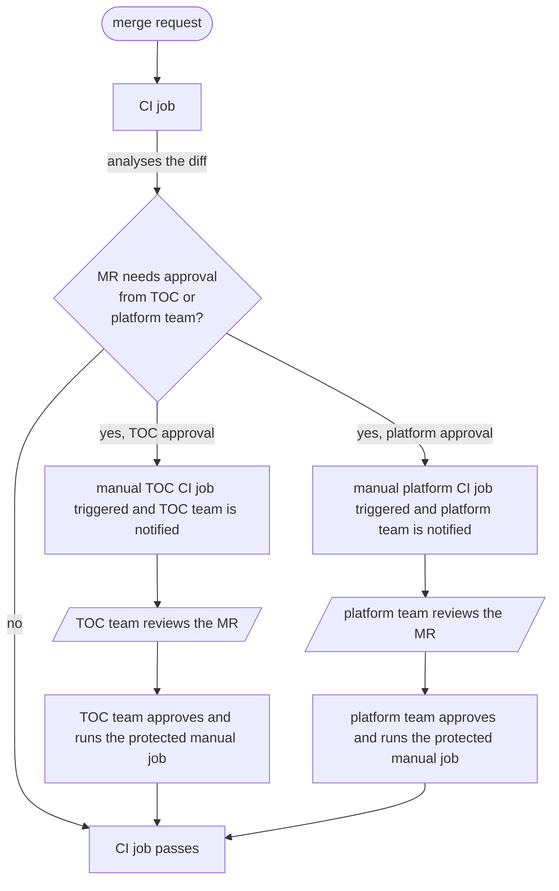

# Identify self-service areas in Data Product Configuration 

## Status

Proposed

## Problem statement

We have set out to build a self-service data platform, but we can improve (a lot) on the self-service bits. Today, each
merge request to the [dataproduct-config](https://gitlab.cee.redhat.com/dataverse/platform-config/dataproduct-config)
repo must be approved by the platform team. The platform team needs to make the dataproduct-config repo as self-service
as possible.

### What should the platform keep gatekeep

This [SOP](https://gitlab.cee.redhat.com/dataverse/sops/-/blob/main/Change%20Management/004_data_product_config_reviewer_checklist.md)
covers the pieces of config that must be reviewed by the platform team.

#### Change in warehouse size
Example: `warehouse: XS` --> `warehouse: L`

**Behavior**:
- When the warehouse size is increased, Platform team's approval is needed.
- No approval needed when the size is reduced.

#### Data Product promotion to preprod / prod
Each time a new product.yaml is created in preprod or prod environments of a data product, the TOC team will be summoned.

**Behavior**:
- TOC approval will be triggered when data product promotion is detected.

#### Migrations

##### ACCOUNTADMIN Migrations
Today, all migrations are run via ACCOUNTADMIN and they must all be approved by the platform team.
These approvals will be controlled via the CODEOWNERS file.

##### Self-service migrations
There are certain operations within the confines of data product RBAC that don't necessarily need platform team approvals.
Use cases:
- Dropping tables
- Creating stored procedures
- DCL commands that DBT cannot run

**Behavior**:
- Self-service migrations will be run as (or via a role of similar grants as) the DBT service account.
- Self-service migrations will live at the path `dataproduct-config/dataproducts/{source|aggregate}/{dataproduct}/{env}/migrations/product/XXX.sql`
- Platform level migrations (run as ACCOUNTADMIN) will live at `dataproduct-config/dataproducts/{source|aggregate}/{dataproduct}/{env}/migrations/platform/XXX.sql`

### Approval for adding sources
This is being covered in [this epic](https://issues.redhat.com/browse/DATA-1608) which should be shipped before making the platform entirely self-service.

### Stronger validations
Need naming convention validations for the following use cases:
```yaml
tags:
  data_product: hellosource
```
Here, the value of the tag must match the name of the data product.

### How will the approvals be triggered

- Create a bot account in GitLab and add it to dataproduct-config-maintainers GitLab group.
- Based on the diff, the bot account will approve/ignore the MR via [GitLab MR Approval API](https://docs.gitlab.com/user/project/merge_requests/approvals/).

Alternative: via environments



- When a merge request is raised, there will be a CI job that will evaluate the changes being made in the merge request.
- Based on the diff (say, the warehouse size is increased), the CI job may trigger another manual job.
- The manual CI job will be [protected](https://docs.gitlab.com/ci/jobs/job_control/#protect-manual-jobs) and run only after the relevant approvals.
- There will exist two GitLab environments, "TOC approval" and "Platform team approval" where the approvals will be given.
- Upon approval, the manual CI job will run and pass.

### Next steps / action items
1. Implement the behaviors listed above
