# 🎯 Rule Creation Guide

This comprehensive guide walks you through implementing new validation rules in the Naysayer project. Whether you're building simple file validators or complex multi-step analysis rules, this guide provides patterns, templates, and best practices to get you started quickly.

> **🚀 New to Naysayer?** Start with the [5-Minute Quick Start](#quick-start) to get your first rule running immediately.

## 📋 Table of Contents

1. [🚀 Quick Start](#quick-start) - Get a rule working in 5 minutes
2. [🏗️ Architecture Overview](#architecture-overview) - How rules work in Naysayer
3. [📝 Planning Your Rule](#planning-your-rule) - Design before you code
4. [⚙️ Implementation Steps](#implementation-steps) - Step-by-step implementation
5. [📁 Templates and Patterns](#templates-and-patterns) - Ready-to-use starting points
6. [✅ Best Practices](#best-practices) - Production-ready guidelines
7. [🔄 Testing Your Rule](#testing-your-rule) - Ensure reliability
8. [📡 Registration & Deployment](#registration--deployment) - Go live
9. [🔧 Troubleshooting](#troubleshooting) - Common issues and solutions

## 🚀 Quick Start

> **⏱️ Time to first working rule: ~5 minutes**

### 🎯 Three-Step Rule Creation

```bash
# 1️⃣ Create new rule directory
mkdir internal/rules/myvalidation

# 2️⃣ Implement the Rule interface (see examples below)
# Create internal/rules/myvalidation/rule.go

# 3️⃣ Register and test
# Follow integration steps below
```

### 🎯 Rule Implementation Patterns

| **Rule Type** | **Best For** | **Time to Implement** |
|---------------|--------------|----------------------|
| 🔍 **Simple Validation** | File patterns, naming rules, basic content | ⏱️ 20 mins |
| 📄 **Content Analysis** | SQL safety, YAML validation, security scanning | ⏱️ 35 mins |
| 🔧 **Multi-Step Validation** | Complex business logic, comprehensive validation | ⏱️ 45 mins |
| 🧪 **Testing** | Comprehensive testing for any rule | ⏱️ 15 mins |

> **💡 Implementation Guide**: Follow the examples and patterns below to implement your rule.

### 🔥 Example: File Extension Validator (5 minutes)

**Goal**: Prevent `.tmp` files from being committed

```bash
# 1. Create rule directory
mkdir internal/rules/tmpfile

# 2. Implement the rule (see example below)
# Create internal/rules/tmpfile/rule.go with Rule interface implementation
```

**Done!** Your rule now blocks `.tmp` files. See [Registration & Deployment](#registration--deployment) to enable it.

## 🏗️ Architecture Overview

### 🔌 Core Rule Interface

Every rule implements the `shared.Rule` interface with **line-level validation methods**:

```go
type Rule interface {
    // 🏷️ Basic identification
    Name() string                                          
    Description() string                                   

    // ✨ Line-level validation methods
    GetCoveredLines(filePath string, fileContent string) []LineRange
    ValidateLines(filePath string, fileContent string, lineRanges []LineRange) (DecisionType, string)
}
```

### ✨ Line-Level Validation

The rule interface enables **line-level validation**:

- **`GetCoveredLines()`**: Declares which line ranges this rule validates
- **`ValidateLines()`**: Validates specific line ranges in files
- **YAML Parsing**: Rules can validate entire files or specific sections
- **Coverage Enforcement**: All lines must be covered by at least one rule

### 🔄 Line-Level Execution Flow

```mermaid
graph TD
    A[🔔 GitLab MR] --> B[📄 File Analysis]
    B --> C[🧩 YAML Section Parsing]
    C --> D[📏 Line Coverage Analysis]
    D --> E[🎯 Rule 1: GetCoveredLines()]
    D --> F[🎯 Rule 2: GetCoveredLines()]
    D --> G[🎯 Rule N: GetCoveredLines()]
    E --> H[🔍 ValidateLines()]
    F --> I[🔍 ValidateLines()]  
    G --> J[🔍 ValidateLines()]
    H --> K{📊 Coverage Complete?}
    I --> K
    J --> K
    K -->|✅ All lines covered & approved| L[🟢 Auto-Approve MR]
    K -->|❌ Uncovered lines or failures| M[🔍 Manual Review Required]
```

### 🎯 Enhanced Decision Logic

| **Step** | **Method** | **Purpose** | **Coverage Enforcement** |
|----------|------------|-------------|--------------------------|
| 1️⃣ | `GetCoveredLines()` | Declare line ranges each rule validates | Map rule responsibility |
| 2️⃣ | `ValidateLines()` | Validate only assigned line ranges | Section-specific validation |
| 3️⃣ | **Coverage Check** | Ensure all lines are covered | Require manual review for gaps |
| 4️⃣ | **Aggregation** | Combine all validation results | Auto-approve only if complete coverage + all pass |

> **🚨 Enhanced Principle**: Auto-approval requires both **complete line coverage** AND **all rules passing**.

### 📁 Rule Structure Example

```
internal/rules/yourule/
├── rule.go              # 🎯 Main rule implementation
├── rule_test.go         # 🧪 Unit tests
├── types.go             # 📋 Data structures
├── validator.go         # 🔍 Validation logic (optional)
└── integration_test.go  # 🚀 End-to-end tests
```

## 📝 Planning Your Rule

> **🎯 Pro Tip**: Spend 10 minutes planning to save hours of refactoring later!

### 🎯 Rule Planning Worksheet

Use this checklist to design your rule before coding:

#### 1️⃣ **Purpose & Scope**
- [ ] **Validation Goal**: What specific safety/quality check does this rule perform?
- [ ] **File Scope**: Which files should trigger this rule? (patterns, extensions, paths)  
- [ ] **Decision Criteria**: When to auto-approve vs require manual review?
- [ ] **Success Metrics**: How will you measure if this rule is working?

#### 2️⃣ **Template Selection**

| **If your rule...** | **Choose** | **Examples** |
|---------------------|------------|--------------|
| 🔍 Checks file patterns/extensions | [`basic_rule_template.go`](templates/rule_templates/basic_rule_template.go.template) | Block .tmp files, require docs |
| 📄 Parses file content | [`content_analysis_rule_template.go`](templates/rule_templates/content_analysis_rule_template.go.template) | SQL safety, YAML validation |
| 🔧 Has multiple validation steps | [`multi_validator_rule_template.go`](templates/rule_templates/multi_validator_rule_template.go.template) | Service accounts, complex configs |

#### 3️⃣ **Configuration Design**
- [ ] **Settings**: What should be configurable? (strict mode, size limits, patterns)
- [ ] **Defaults**: What are safe, sensible defaults?
- [ ] **Environment Variables**: Follow the `YOUR_RULE_*` naming pattern
- [ ] **Backward Compatibility**: How will this affect existing MRs?

### 📋 Planning Templates

#### Simple File Validation Example
```yaml
Rule Name: file_naming_rule
Purpose: Enforce consistent file naming conventions
Files: "*.yaml, *.yml in config/"
Auto-Approve: Files follow snake_case pattern
Manual Review: Files with spaces, special chars, or UPPERCASE
Config:
  - FILE_NAMING_STRICT_MODE=false
  - FILE_NAMING_ALLOWED_PATTERNS="*.yaml,*.yml"
  - FILE_NAMING_EXCLUDED_PATHS="test/,temp/"
```

#### Content Analysis Example  
```yaml
Rule Name: migration_safety_rule
Purpose: Prevent unsafe database operations
Files: "migrations/*.sql"
Auto-Approve: CREATE INDEX, ADD COLUMN, safe operations
Manual Review: DROP, ALTER TABLE, data type changes
Config:
  - MIGRATION_ALLOW_DROPS=false
  - MIGRATION_SAFE_OPERATIONS="CREATE,ALTER ADD,INSERT"
  - MIGRATION_MAX_FILE_SIZE=1048576
```

#### Multi-Validator Example
```yaml
Rule Name: security_config_rule  
Purpose: Validate security configurations
Files: "security/*.yaml, auth/*.json"
Validators:
  1. Format: Valid YAML/JSON syntax
  2. Security: No hardcoded secrets
  3. Compliance: Required fields present
  4. Business: Meets company policies
Config:
  - SECURITY_CONFIG_STRICT_MODE=true
  - SECURITY_CONFIG_SECRET_PATTERNS="password,key,token"
  - SECURITY_CONFIG_REQUIRED_FIELDS="owner,environment"
```

### 🎯 Decision Tree: Which Template Should I Use?

```mermaid
graph TD
    A[🤔 What does your rule validate?] --> B{File patterns only?}
    B -->|Yes| C[📁 Basic Template<br/>File extension checks<br/>Path validation]
    B -->|No| D{Parse file content?}
    D -->|Yes| E{Simple parsing?}
    E -->|Yes| F[📄 Content Analysis Template<br/>SQL, YAML, JSON validation<br/>Regex patterns]
    E -->|No| G[🔧 Multi-Validator Template<br/>Multiple validation steps<br/>Complex business logic]
    D -->|No| H[🔧 Multi-Validator Template<br/>Custom validation pipeline]
```



## Implementation Steps

### Step 1: Set Up Structure
```bash
mkdir internal/rules/yourule
cd internal/rules/yourule
```

### Step 2: Copy Templates
Choose and copy the appropriate template:
```bash
# For simple rules
cp ../../docs/templates/rule_templates/basic_rule_template.go.template rule.go

# For content analysis  
cp ../../docs/templates/rule_templates/content_analysis_rule_template.go.template rule.go

# For complex multi-step validation
cp ../../docs/templates/rule_templates/multi_validator_rule_template.go.template rule.go
```

### Step 3: Implement Line-Level Methods

#### ✨ NEW: Implement Line-Level Validation
```go
// 1. GetCoveredLines - Declare which lines your rule validates
func (r *Rule) GetCoveredLines(filePath string, fileContent string) []shared.LineRange {
    if !r.appliesToFile(filePath) {
        return nil // Rule doesn't apply to this file
    }

    // Option A: Validate entire file
    totalLines := shared.CountLines(fileContent)
    return []shared.LineRange{{StartLine: 1, EndLine: totalLines, FilePath: filePath}}

    // Option B: Validate specific YAML sections
    yamlResult := shared.ParseYAMLWithLineNumbers(filePath, fileContent)
    var coveredLines []shared.LineRange
    for _, section := range yamlResult.Sections {
        if section.Name == "warehouses" || section.Name == "service_account" {
            coveredLines = append(coveredLines, section.ToLineRange())
        }
    }
    return coveredLines
}

// 2. ValidateLines - Validate only the specified line ranges
func (r *Rule) ValidateLines(filePath string, fileContent string, lineRanges []shared.LineRange) (shared.DecisionType, string) {
    if !r.appliesToFile(filePath) {
        return shared.Approve, "Rule does not apply to this file"
    }

    // Your validation logic here - only check the specified line ranges
    for _, lineRange := range lineRanges {
        if err := r.validateLineRange(filePath, fileContent, lineRange); err != nil {
            return shared.ManualReview, fmt.Sprintf("Validation failed for lines %d-%d: %v", 
                lineRange.StartLine, lineRange.EndLine, err)
        }
    }

    return shared.Approve, "Line range validation passed"
}
```

#### 📜 LEGACY: Maintain Backward Compatibility
```go
// 3. Applies - Legacy method (use for backward compatibility)
func (r *Rule) Applies(mrCtx *shared.MRContext) bool {
    for _, change := range mrCtx.Changes {
        if r.appliesToFile(change.NewPath) || r.appliesToFile(change.OldPath) {
            return true
        }
    }
    return false
}

// 4. ShouldApprove - Legacy method (delegate to line-level validation)
func (r *Rule) ShouldApprove(mrCtx *shared.MRContext) (shared.DecisionType, string) {
    // For backward compatibility, validate entire files
    for _, change := range mrCtx.Changes {
        if !r.appliesToFile(change.NewPath) {
            continue
        }
        
        // Fetch file content and validate all lines
        fileContent := r.getFileContent(change.NewPath)
        totalLines := shared.CountLines(fileContent)
        allLines := []shared.LineRange{{StartLine: 1, EndLine: totalLines, FilePath: change.NewPath}}
        
        decision, reason := r.ValidateLines(change.NewPath, fileContent, allLines)
        if decision == shared.ManualReview {
            return decision, reason
        }
    }
    return shared.Approve, "All files validated successfully"
}
```

#### 🧩 YAML Section-Aware Validation Example
```go
func (r *Rule) ValidateLines(filePath string, fileContent string, lineRanges []shared.LineRange) (shared.DecisionType, string) {
    // Parse YAML with line number tracking
    yamlResult := shared.ParseYAMLWithLineNumbers(filePath, fileContent)
    
    // Validate only sections that overlap with our line ranges
    for _, lineRange := range lineRanges {
        for _, section := range yamlResult.Sections {
            if section.StartLine <= lineRange.EndLine && section.EndLine >= lineRange.StartLine {
                // This section overlaps with our responsibility
                if err := r.validateYAMLSection(section); err != nil {
                    return shared.ManualReview, fmt.Sprintf("Section '%s' validation failed: %v", section.Name, err)
                }
            }
        }
    }
    
    return shared.Approve, "YAML sections validated successfully"
}

func (r *Rule) validateYAMLSection(section shared.YAMLSection) error {
    switch section.Name {
    case "warehouses":
        return r.validateWarehouseSection(section)
    case "service_account":
        return r.validateServiceAccountSection(section)
    default:
        return nil // Section not our responsibility
    }
}
```

### Step 4: Update Configuration and Structure
1. **Update package name** and rule identifier
2. **Define file patterns** - Which files trigger your rule
3. **Add configuration** - Define your config structure and defaults
4. **Error handling** - Graceful handling of edge cases

### Step 5: Add Tests
```bash
# Copy test template
cp ../../docs/templates/rule_templates/rule_test_template.go.template rule_test.go

# Copy mock client patterns  
cp ../../docs/templates/rule_templates/mock_client_template.go.template .
```

See [Rule Testing Guide](RULE_TESTING_GUIDE.md) for comprehensive testing strategies.

## Templates and Patterns

### Available Templates

| Template | Use Case | Features |
|----------|----------|----------|
| `basic_rule_template.go.template` | Simple file/pattern validation | File filtering, basic content checks |
| `content_analysis_rule_template.go.template` | Parse and analyze file content | Regex patterns, content parsing, detailed analysis |
| `multi_validator_rule_template.go.template` | Complex multi-step validation | Multiple validators, sequential pipeline |
| `rule_test_template.go.template` | Comprehensive testing | Interface tests, decision logic, error handling |
| `mock_client_template.go.template` | Test scenarios | Simple and advanced mock patterns |
| `integration_test_template.go.template` | End-to-end testing | Complete workflow validation |

### Pattern Selection Guide

**Choose Basic Template When**:
- Checking file patterns or extensions
- Simple content validation
- Basic business rules

**Choose Content Analysis When**:
- Parsing SQL, YAML, or structured content
- Complex pattern matching
- Detailed content analysis

**Choose Multi-Validator When**:
- Multiple validation concerns (format + business + security)
- Sequential validation pipeline
- Modular validation components

### Existing Rule Examples
- **Warehouse Rule**: Content analysis pattern (SQL/YAML parsing)
- **Service Account Rule**: Multi-validator pattern (email + naming + scoping + environment)

## Best Practices

### Error Handling Principles
1. **Fail Safe**: When in doubt, require manual review
2. **Clear Messages**: Include file paths and specific reasons in error messages
3. **Common Scenarios**: Handle timeouts, missing files, large files gracefully

See error handling patterns in [`basic_rule_template.go.template`](templates/rule_templates/basic_rule_template.go.template).

### Performance Guidelines
1. **Early Returns**: Exit as soon as decision is clear
2. **Size Limits**: Skip files exceeding reasonable size limits
3. **Efficient Patterns**: Use optimized string matching and regex
4. **Minimal API Calls**: Only fetch files you actually need to analyze

### Security Best Practices
1. **No Sensitive Logging**: Never log file content or secrets
2. **Input Validation**: Validate file paths and content size
3. **Safe Parsing**: Handle malformed content without crashing

### Code Organization
1. **Separation of Concerns**: Keep validation logic separate from interface implementation
2. **Testable Functions**: Break complex logic into small, testable functions
3. **Clear Naming**: Use descriptive names for functions and variables

## 🔄 Testing Your Rule

> **🧪 Testing is crucial**: Well-tested rules prevent production issues and false positives.

### 🚀 Quick Test Commands

```bash
# Run your rule tests
go test ./internal/rules/yourule -v

# Run with coverage (aim for 80%+)
go test ./internal/rules/yourule -cover -coverprofile=coverage.out
go tool cover -html=coverage.out  # View coverage in browser

# Run specific test pattern
go test ./internal/rules/yourule -run TestRule_ShouldApprove -v

# Test with race detection
go test ./internal/rules/yourule -race
```

### 🎭 Mock Client Usage

Use the powerful mock patterns from [`mock_client_template.go.template`](templates/rule_templates/mock_client_template.go.template):

```go
// 🟢 Simple scenario
client := &MockGitLabClient{fileContent: "test content"}

// 🔥 Builder pattern for complex scenarios  
client := NewMockGitLabClient().
    WithFile("config/valid.yaml", "valid content").
    WithFile("config/invalid.yaml", "invalid content").
    WithFileError("config/error.yaml", fmt.Errorf("network error")).
    Build()

// 🧪 Test with realistic scenarios
client := NewMockGitLabClient().
    WithFile("prod.yaml", "warehouse: LARGE").
    WithFile("dev.yaml", "warehouse: SMALL").
    Build()
```

### 📋 Essential Test Cases

Ensure your rule handles these scenarios:

- [ ] ✅ **Happy Path**: Valid files should auto-approve
- [ ] ❌ **Invalid Content**: Bad files should require manual review  
- [ ] 🚫 **File Not Found**: Handle missing files gracefully
- [ ] 🕸️ **Network Errors**: Handle GitLab API failures
- [ ] 📏 **Large Files**: Handle size limits appropriately
- [ ] 🔀 **Mixed Results**: Some files pass, others fail
- [ ] ⚙️ **Configuration Changes**: Test different config settings

### 🧪 Integration Testing 

See [`integration_test_template.go.template`](templates/rule_templates/integration_test_template.go.template) for complete end-to-end testing patterns.

For comprehensive testing strategies, see: **[Rule Testing Guide](RULE_TESTING_GUIDE.md)**

## 📡 Registration & Deployment

### 🔗 Step 1: Register Your Rule

Add your rule to the system registry in `internal/rules/registry.go`:

```go
r.RegisterRule(&RuleInfo{
    Name:        "your_rule_name",
    Description: "Your rule description",
    Version:     "1.0.0",
    Factory: func(client *gitlab.Client) shared.Rule {
        return yourule.NewRule(client)
    },
    Enabled:  true,
    Category: "your_category",
})
```

### ⚙️ Step 2: Configure Environment Variables

```bash
# Enable your rule
YOUR_RULE_ENABLED=true

# Configure rule settings
YOUR_RULE_STRICT_MODE=false
YOUR_RULE_MAX_FILE_SIZE=1048576
YOUR_RULE_ALLOWED_EXTENSIONS=.yaml,.yml,.json
```

### 🚀 Step 3: Deploy & Monitor

```bash
# Test locally first
make test

# Deploy to development
kubectl apply -f config/

# Monitor rule performance
kubectl logs -f deployment/naysayer | grep "your_rule_name"
```

### 🔧 Step 4: Verify Rule is Working

```bash
# Check rule is registered
curl http://localhost:3000/api/rules | jq '.rules[] | select(.name=="your_rule_name")'

# Test with a sample MR
# Create test MR → Check logs for rule execution
```

For detailed integration steps, see: **[Rule Registration Guide](RULE_REGISTRATION_GUIDE.md)**

## 🔧 Troubleshooting

### 🐛 Common Issues

#### Rule Not Triggering
```bash
# Check if Applies() method is working
grep "Applies.*your_rule" logs/
# Verify file patterns match actual changes
```

#### False Positives
```bash
# Review validation logic
# Add debug logging temporarily
# Test with edge cases
```

#### Configuration Issues
```bash
# Verify environment variables
env | grep YOUR_RULE
# Check default values in config.go
```

#### Performance Problems
```bash
# Profile your rule
go test -bench=. -cpuprofile=cpu.prof
go tool pprof cpu.prof
```

### 🆘 Getting Help

- **🔍 Debug Mode**: Set `LOG_LEVEL=debug` for detailed logs
- **📚 Examples**: Study existing rules in `internal/rules/`
- **🧪 Templates**: Use provided templates as reference
- **📝 Documentation**: Check specific guides for detailed help

### 📚 Related Guides

| **Topic** | **Guide** | **When to Use** |
|-----------|-----------|----------------|
| 🧪 **Testing** | [Rule Testing Guide](RULE_TESTING_GUIDE.md) | Comprehensive testing strategies |
| 📡 **Registration** | [Rule Registration Guide](RULE_REGISTRATION_GUIDE.md) | System integration and deployment |

## ✅ Rule Creation Checklist

Before you mark your rule as complete:

### 📝 **Implementation**
- [ ] Rule implements all 4 interface methods correctly
- [ ] File pattern matching works as expected
- [ ] Validation logic handles edge cases
- [ ] Error messages are clear and actionable
- [ ] Configuration is properly loaded

### 🧪 **Testing**  
- [ ] Unit tests cover all major code paths
- [ ] Integration tests verify end-to-end behavior
- [ ] Error scenarios are tested
- [ ] Performance is acceptable
- [ ] Mock clients simulate realistic scenarios

### 📡 **Integration**
- [ ] Rule is registered in the registry
- [ ] Configuration is added to config.go
- [ ] Environment variables are documented
- [ ] Rule can be enabled/disabled safely

### 🚀 **Deployment**
- [ ] Rule works in development environment
- [ ] Logs show rule execution correctly
- [ ] Performance impact is minimal
- [ ] Documentation is updated

**🎉 Congratulations!** Your rule is ready for production use.

## 🎓 Advanced Topics

### 🔄 Rule Composition Patterns

#### Decorator Pattern for Rule Enhancement
```go
type RuleDecorator struct {
    rule shared.Rule
    decorator func(shared.DecisionType, string) (shared.DecisionType, string)
}

func WithMetrics(rule shared.Rule) shared.Rule {
    return &RuleDecorator{
        rule: rule,
        decorator: func(decision shared.DecisionType, reason string) (shared.DecisionType, string) {
            // Add metrics collection
            metrics.RecordRuleDecision(rule.Name(), decision)
            return decision, reason
        },
    }
}
```

#### Conditional Rule Execution
```go
type ConditionalRule struct {
    rule      shared.Rule
    condition func(*shared.MRContext) bool
}

func (c *ConditionalRule) Applies(mrCtx *shared.MRContext) bool {
    return c.rule.Applies(mrCtx) && c.condition(mrCtx)
}

// Usage: Only run rule during business hours
rule := &ConditionalRule{
    rule: myRule,
    condition: func(mrCtx *shared.MRContext) bool {
        return isBusinessHours(time.Now())
    },
}
```

### 🔒 Security Best Practices

#### Input Sanitization
```go
func sanitizeFilePath(path string) string {
    // Prevent path traversal attacks
    cleaned := filepath.Clean(path)
    if strings.Contains(cleaned, "..") {
        return ""
    }
    return cleaned
}

func (r *Rule) ShouldApprove(mrCtx *shared.MRContext) (shared.DecisionType, string) {
    for _, change := range mrCtx.Changes {
        safePath := sanitizeFilePath(change.NewPath)
        if safePath == "" {
            return shared.ManualReview, "Invalid file path detected"
        }
        // Continue with safe path
    }
}
```

#### Content Size Limits
```go
const (
    MaxFileSize     = 1 * 1024 * 1024  // 1MB
    MaxFilesPerMR   = 100              // Maximum files to process
    MaxContentLines = 10000            // Maximum lines to analyze
)

func (r *Rule) validateSafeLimits(content string) error {
    if len(content) > MaxFileSize {
        return fmt.Errorf("file too large: %d bytes", len(content))
    }
    
    lines := strings.Count(content, "\n")
    if lines > MaxContentLines {
        return fmt.Errorf("too many lines: %d", lines)
    }
    
    return nil
}
```

### ⚡ Performance Optimization

#### Caching Patterns
```go
type CachedRule struct {
    rule  shared.Rule
    cache map[string]cacheEntry
    mutex sync.RWMutex
}

type cacheEntry struct {
    decision shared.DecisionType
    reason   string
    expires  time.Time
}

func (c *CachedRule) ShouldApprove(mrCtx *shared.MRContext) (shared.DecisionType, string) {
    // Create cache key from file content hash
    key := c.createCacheKey(mrCtx)
    
    c.mutex.RLock()
    if entry, exists := c.cache[key]; exists && time.Now().Before(entry.expires) {
        c.mutex.RUnlock()
        return entry.decision, entry.reason
    }
    c.mutex.RUnlock()
    
    // Execute rule and cache result
    decision, reason := c.rule.ShouldApprove(mrCtx)
    
    c.mutex.Lock()
    c.cache[key] = cacheEntry{
        decision: decision,
        reason:   reason,
        expires:  time.Now().Add(5 * time.Minute),
    }
    c.mutex.Unlock()
    
    return decision, reason
}
```

#### Parallel Processing
```go
func (r *Rule) ShouldApprove(mrCtx *shared.MRContext) (shared.DecisionType, string) {
    type result struct {
        path     string
        valid    bool
        err      error
    }
    
    results := make(chan result, len(mrCtx.Changes))
    var wg sync.WaitGroup
    
    // Process files in parallel
    for _, change := range mrCtx.Changes {
        if !r.shouldValidateFile(change.NewPath) {
            continue
        }
        
        wg.Add(1)
        go func(path string) {
            defer wg.Done()
            
            content, err := r.client.FetchFileContent(mrCtx.ProjectID, path, "HEAD")
            if err != nil {
                results <- result{path: path, err: err}
                return
            }
            
            valid := r.validateContent(path, content.Content)
            results <- result{path: path, valid: valid}
        }(change.NewPath)
    }
    
    go func() {
        wg.Wait()
        close(results)
    }()
    
    // Collect results
    for result := range results {
        if result.err != nil {
            return shared.ManualReview, fmt.Sprintf("Failed to process %s: %v", result.path, result.err)
        }
        if !result.valid {
            return shared.ManualReview, fmt.Sprintf("Validation failed for %s", result.path)
        }
    }
    
    return shared.Approve, "All files validated successfully"
}
```

### 📊 Monitoring and Observability

#### Custom Metrics
```go
import (
    "github.com/prometheus/client_golang/prometheus"
    "github.com/prometheus/client_golang/prometheus/promauto"
)

var (
    ruleExecutionDuration = promauto.NewHistogramVec(
        prometheus.HistogramOpts{
            Name: "naysayer_rule_execution_duration_seconds",
            Help: "Time spent executing rules",
        },
        []string{"rule_name", "decision"},
    )
    
    ruleExecutionTotal = promauto.NewCounterVec(
        prometheus.CounterOpts{
            Name: "naysayer_rule_execution_total",
            Help: "Total number of rule executions",
        },
        []string{"rule_name", "decision"},
    )
)

func (r *Rule) ShouldApprove(mrCtx *shared.MRContext) (shared.DecisionType, string) {
    start := time.Now()
    defer func() {
        duration := time.Since(start).Seconds()
        decision, _ := r.getDecision(mrCtx) // Your actual decision logic
        
        ruleExecutionDuration.WithLabelValues(r.Name(), string(decision)).Observe(duration)
        ruleExecutionTotal.WithLabelValues(r.Name(), string(decision)).Inc()
    }()
    
    // Your rule implementation
    return r.getDecision(mrCtx)
}
```

#### Structured Logging
```go
import "go.uber.org/zap"

func (r *Rule) ShouldApprove(mrCtx *shared.MRContext) (shared.DecisionType, string) {
    logger := zap.L().With(
        zap.String("rule", r.Name()),
        zap.Int("project_id", mrCtx.ProjectID),
        zap.Int("mr_iid", mrCtx.MRIID),
        zap.Int("file_count", len(mrCtx.Changes)),
    )
    
    logger.Info("Starting rule evaluation")
    
    start := time.Now()
    decision, reason := r.evaluateRule(mrCtx)
    duration := time.Since(start)
    
    logger.Info("Rule evaluation completed",
        zap.String("decision", string(decision)),
        zap.String("reason", reason),
        zap.Duration("duration", duration),
    )
    
    return decision, reason
}
```

### 🔧 Advanced Configuration Patterns

#### Environment-Specific Settings
```go
type EnvironmentConfig struct {
    Development EnvironmentSettings `yaml:"development"`
    Staging     EnvironmentSettings `yaml:"staging"`
    Production  EnvironmentSettings `yaml:"production"`
}

type EnvironmentSettings struct {
    StrictMode      bool     `yaml:"strict_mode"`
    AllowedPatterns []string `yaml:"allowed_patterns"`
    MaxFileSize     int      `yaml:"max_file_size"`
}

func (r *Rule) getConfigForEnvironment() EnvironmentSettings {
    env := os.Getenv("ENVIRONMENT")
    switch env {
    case "production":
        return r.config.Production
    case "staging":
        return r.config.Staging
    default:
        return r.config.Development
    }
}
```

#### Feature Flags Integration
```go
type FeatureFlags struct {
    EnableAdvancedValidation bool `yaml:"enable_advanced_validation"`
    UseParallelProcessing   bool `yaml:"use_parallel_processing"`
    EnableCaching           bool `yaml:"enable_caching"`
}

func (r *Rule) ShouldApprove(mrCtx *shared.MRContext) (shared.DecisionType, string) {
    if r.featureFlags.EnableAdvancedValidation {
        return r.advancedValidation(mrCtx)
    }
    return r.basicValidation(mrCtx)
}
```

### 📚 Resources for Advanced Development

- **Performance Profiling**: `go tool pprof` for CPU and memory analysis
- **Load Testing**: Create test scenarios with high file counts
- **Security Scanning**: Regular code reviews for security vulnerabilities
- **Monitoring**: Set up alerts for rule performance and error rates

**🚀 Next Level**: Consider contributing your advanced patterns back to the Naysayer project to help other developers!