# 🏗️ Section-Based Policy Architecture - Business Overview

## 📋 Overview

NAYSAYER employs a **Section-Based Policy Architecture** that provides precise control over configuration validation. Instead of reviewing entire files, the system can target specific sections, enabling more efficient and focused policy enforcement.

## 🎯 Business Benefits

- **🎯 Targeted Validation**: Policies apply only to relevant configuration sections
- **⚡ Faster Processing**: Only necessary sections are reviewed
- **🔧 Flexible Governance**: Different policies for different parts of the same file
- **📊 Clear Accountability**: Specific policies for specific configuration areas
- **🧩 Scalable Compliance**: Easy to add new policies without disrupting existing ones

## 🏗️ How It Works

```mermaid
graph TB
    subgraph "📄 Configuration File Processing"
        A[Configuration File Change] --> B[Identify File Type]
        B --> C[Parse Into Sections]
        C --> D[Apply Relevant Policies]
    end
    
    subgraph "🎯 Policy Application"
        D --> E[Warehouse Policy]
        D --> F[Service Account Policy]
        D --> G[Documentation Policy]
    end
    
    subgraph "📊 Decision Making"
        E --> H[Section Results]
        F --> H
        G --> H
        H --> I[Overall Decision]
    end
    
    classDef process fill:#e1f5fe,stroke:#0288d1,stroke-width:2px
    classDef policy fill:#e8f5e8,stroke:#4caf50,stroke-width:2px
    classDef decision fill:#fff3e0,stroke:#f57c00,stroke-width:2px
    
    class A,B,C,D process
    class E,F,G policy
    class H,I decision
```



## 📊 Business Value

### Operational Efficiency
- **Focused Reviews**: Only relevant sections require attention
- **Faster Decisions**: Reduced processing time for configuration changes
- **Clear Ownership**: Specific policies for specific business areas
- **Reduced Bottlenecks**: Multiple teams can work on different sections simultaneously

### Governance & Compliance
- **Mandatory Validation**: All files must have section-based configuration or require manual review
- **Granular Control**: Precise policy enforcement for different configuration areas
- **Audit Clarity**: Clear tracking of which policies applied to which sections
- **Risk Management**: Targeted validation where it matters most
- **No Legacy Fallbacks**: Ensures consistent application of current policies

## 🔧 Configuration Management

### Centralized Policy Configuration

All policies are defined in a central configuration file that specifies:

- **File Types**: Which files are subject to validation
- **Section Definitions**: How files are divided into logical sections
- **Policy Mappings**: Which policies apply to which sections

**Example Configuration Structure**:
```yaml
# Central policy configuration
files:
  - name: "product_configurations"
    pattern: "**/product.yaml"
    sections:
      - name: warehouses
        policy: warehouse_cost_control
      - name: service_accounts  
        policy: identity_management
      - name: documentation
        policy: content_management
```

### Business-Focused Section Organization

**Warehouse Configurations**:
- **Purpose**: Cost control and resource management
- **Policy**: Auto-approve cost reductions, review cost increases
- **Business Impact**: Budget governance and operational efficiency

**Service Account Configurations**:
- **Purpose**: Identity and access management
- **Policy**: Auto-approve trusted patterns, review custom configurations
- **Business Impact**: Security compliance and operational automation

**Documentation Sections**:
- **Purpose**: Knowledge management and team communication
- **Policy**: Auto-approve all documentation changes
- **Business Impact**: Improved collaboration and reduced bureaucracy

## 📊 Policy Compliance Matrix

| **Configuration Section** | **Business Purpose** | **Auto-Approval** | **Review Requirements** |
|---------------------------|---------------------|-------------------|------------------------|
| **Warehouse Resources** | Cost control | Size decreases | Budget approval for increases |
| **Service Accounts** | Security compliance | Trusted patterns | Security review for custom configs |
| **Documentation** | Knowledge sharing | All changes | None required |
| **Team Metadata** | Collaboration | All changes | None required |
| **Unconfigured Files** | Risk management | Never | Manual review required |

## 🔍 Error Handling & Coverage

### Mandatory Section Configuration
- **All files must be covered** by section-based validation configuration
- **No traditional rule fallbacks** - files without section configuration require manual review
- **Clear error messages** when files don't match any configured patterns
- **System startup validation** ensures all required configuration is present

### Unconfigured File Handling
- **Immediate Manual Review**: Files without section configuration automatically require review
- **Clear Messaging**: Specific error messages explain why manual review is needed
- **Coverage Tracking**: System tracks which files lack section-based configuration
- **Expansion Guidance**: Clear process for adding new file types to section-based validation


## 🚀 Scalability & Future Growth

### Easy Policy Addition
- **Modular Design**: New policies can be added without affecting existing ones
- **Section Flexibility**: New configuration sections easily accommodated
- **Business Alignment**: Policies organized by business function rather than technical implementation

---

**📋 Summary**: The Section-Based Policy Architecture provides precise, efficient governance that scales with business needs while reducing operational overhead and improving compliance clarity.

**🔍 For Technical Implementation**: Detailed technical specifications available in development documentation