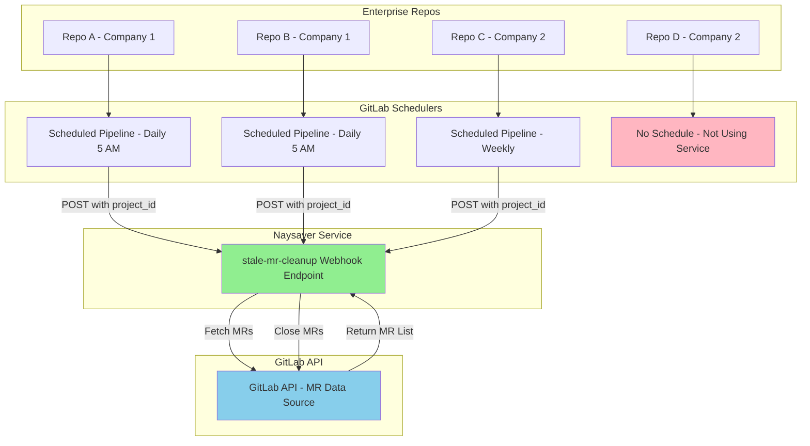

# Stale MR Cleanup - Architecture Documentation

## Overview

The Stale MR Cleanup feature automatically closes inactive merge requests using a stateless, pull-based architecture. Repositories opt-in independently via scheduled GitLab CI jobs, enabling the system to scale across thousands of repositories without central configuration.

**For setup instructions, see [STALE_MR_SETUP.md](./STALE_MR_SETUP.md)**

This document explains the architectural design decisions and why the system is built this way.

---

## High-Level Architecture

**Key Points:**
- ✅ Repos opt-in independently by adding scheduled pipeline
- ✅ Naysayer has **ZERO knowledge** of which repos exist
- ✅ Each repo controls its own schedule and thresholds
- ✅ Naysayer remains completely stateless

---

## Why Stateless Architecture?

### Design Requirements
1. **Open-Source:** Naysayer code is public
2. **Enterprise Use:** Used by multiple companies
3. **No Central Registry:** Can't hardcode repo lists
4. **Self-Service:** Repos opt-in independently

### Stateless Design Solution

**What Naysayer DOES:**
- Accept HTTP webhook requests
- Query GitLab API for MR data
- Process and evaluate MRs
- Return results

**What Naysayer DOES NOT:**
- ❌ Store repo lists
- ❌ Store MR data
- ❌ Use a database
- ❌ Track any state

**Benefits:**
- ✅ **Scalable:** No state = unlimited repos
- ✅ **Open-Source Friendly:** No enterprise data in code
- ✅ **Simple Deployment:** No database required
- ✅ **Self-Service:** Repos manage themselves

### Pull-Based vs Push-Based

**Traditional (Event-Driven):**
- GitLab pushes events → Naysayer reacts
- Works for immediate actions (MR opened, commit pushed)

**Stale MR Cleanup (Scheduled):**
- Repo pulls (scheduled call) → Naysayer responds
- **Why?** Time-based logic (30 days old) requires scheduled evaluation
- Enables repos to opt-in without naysayer configuration

---

## Security Model

**Security Layers:**
1. **Token Authentication:** `WEBHOOK_SECRET` required via `X-Gitlab-Token` header
2. **IP Allowlisting:** Optional restriction (`WEBHOOK_ALLOWED_IPS`)
3. **Payload Validation:** JSON structure validation
4. **Required Fields:** `project_id` must be present
5. **Dedicated Token:** Optional `GITLAB_TOKEN_STALE_MR` for least-privilege access

---

## Configuration Options

See [STALE_MR_SETUP.md](./STALE_MR_SETUP.md) for detailed configuration options and examples.

**Quick reference:**
- `STALE_MR_CLOSURE_DAYS` - Default threshold (default: 30 days)
- `GITLAB_TOKEN_STALE_MR` - Dedicated token for MR operations (optional)
- `WEBHOOK_SECRET` - Webhook authentication token (required)

---

## Summary

### Architecture Principles
1. ✅ **Stateless:** Zero persistence, zero state
2. ✅ **Self-Service:** Repos opt-in independently
3. ✅ **Scalable:** Handles 1 repo or 10,000 repos
4. ✅ **Open-Source:** No enterprise-specific code
5. ✅ **Flexible:** Per-repo customization via payload

### Key Innovation
**Pull-based scheduled maintenance** instead of push-based event webhooks, enabling time-based MR cleanup without central configuration.
