# How to Enable Stale MR Cleanup

## Overview

This guide shows you how to enable automated cleanup of stale merge requests in your GitLab repository. The feature automatically closes MRs after a configurable period of inactivity (default: 30 days).

### Setup Process Overview

```mermaid
flowchart TD
    START[🚀 Start: Ready to Enable?]
    PREREQ{✓ Have Prerequisites?}
    STEP1[📝 Step 1: Add CI Job to .gitlab-ci.yml]
    STEP2[⏰ Step 2: Create GitLab Schedule]
    STEP3[🔐 Step 3: Add WEBHOOK_SECRET Variable]
    STEP4[🧪 Step 4: Run Dry Run Test]
    REVIEW{📊 Results Look Good?}
    ADJUST[⚙️ Adjust Thresholds]
    STEP5[🚀 Step 5: Enable Production Mode]
    STEP6[👀 Step 6: Monitor First Week]
    DONE[✅ Feature Enabled]

    START --> PREREQ
    PREREQ -->|No| PREREQ
    PREREQ -->|Yes| STEP1
    STEP1 --> STEP2
    STEP2 --> STEP3
    STEP3 --> STEP4
    STEP4 --> REVIEW
    REVIEW -->|No| ADJUST
    ADJUST --> STEP4
    REVIEW -->|Yes| STEP5
    STEP5 --> STEP6
    STEP6 --> DONE

    style START fill:#4CAF50,stroke:#2E7D32,stroke-width:3px,color:#fff
    style DONE fill:#4CAF50,stroke:#2E7D32,stroke-width:3px,color:#fff
    style PREREQ fill:#2196F3,stroke:#1565C0,stroke-width:2px,color:#fff
    style REVIEW fill:#FFC107,stroke:#F57C00,stroke-width:2px,color:#000
    style ADJUST fill:#FF9800,stroke:#E65100,stroke-width:2px,color:#fff
    style STEP1 fill:#E3F2FD,stroke:#1976D2,stroke-width:2px
    style STEP2 fill:#E3F2FD,stroke:#1976D2,stroke-width:2px
    style STEP3 fill:#E3F2FD,stroke:#1976D2,stroke-width:2px
    style STEP4 fill:#FFF3E0,stroke:#F57C00,stroke-width:2px
    style STEP5 fill:#E8F5E9,stroke:#388E3C,stroke-width:2px
    style STEP6 fill:#E8F5E9,stroke:#388E3C,stroke-width:2px
```



---

## Prerequisites

Before starting:
- [ ] GitLab repository with maintainer/owner access
- [ ] Naysayer webhook URL (e.g., `https://naysayer.example.com`)
- [ ] Webhook secret token (from your naysayer deployment)

---

## Step 1: Add CI Job

Add this job to your `.gitlab-ci.yml`:

```yaml
stages:
  - maintenance  # Add if it doesn't exist

stale-mr-cleanup:
  stage: maintenance
  only:
    - schedules
  script:
    - |
      curl -X POST https://naysayer.example.com/stale-mr-cleanup \
        -H "Content-Type: application/json" \
        -H "X-Gitlab-Token: ${WEBHOOK_SECRET}" \
        -d "{
          \"project_id\": ${CI_PROJECT_ID},
          \"closure_days\": 30,
          \"dry_run\": true
        }"
  allow_failure: true
```

**Note:** Replace `https://naysayer.example.com` with your naysayer URL.

### Configuration Options

| Field | Default | Description |
|-------|---------|-------------|
| `project_id` | - | Your GitLab project ID (use `${CI_PROJECT_ID}`) |
| `closure_days` | 30 | Days before MR is closed |
| `dry_run` | - | Set `true` to test without making changes |

---

## Step 2: Create Schedule

1. Go to **CI/CD → Schedules** in your GitLab repository
2. Click **New schedule**
3. Configure:
   - **Description:** `Stale MR Cleanup`
   - **Interval Pattern:** `0 5 * * *` (daily at 5 AM UTC)
   - **Target branch:** `main` (or your default branch)
   - **Activated:** ✅ Check this
4. Click **Save pipeline schedule**

---

## Step 3: Add Webhook Secret

1. Go to **Settings → CI/CD → Variables**
2. Click **Add variable**
3. Configure:
   - **Key:** `WEBHOOK_SECRET`
   - **Value:** Your naysayer webhook secret
   - **Protect variable:** ✅ (recommended)
   - **Mask variable:** ✅ (recommended)
4. Click **Add variable**

---

## Step 4: Test with Dry Run

**Important:** Always test with `dry_run: true` first.

1. Ensure your CI job has `"dry_run": true` (from Step 1)
2. Go to **CI/CD → Schedules**
3. Click the ▶️ play button next to your schedule
4. View the job log

### Example Output

```json
{
  "status": "completed",
  "project_id": 123,
  "total_mrs": 15,
  "closed": 2,
  "failed": 0,
  "dry_run": true
}
```

### What the Numbers Mean

- `total_mrs`: Total open MRs examined
- `closed`: MRs that would be closed (30+ days old)
- `failed`: MRs that couldn't be processed

### Adjust If Needed

**Too many MRs being closed?** Increase threshold:
```yaml
"closure_days": 45
```

**Too few MRs being closed?** Decrease threshold:
```yaml
"closure_days": 20
```

---

## Step 5: Enable Production Mode

Once dry run results look good:

1. Edit `.gitlab-ci.yml`
2. Change `"dry_run": true` to `"dry_run": false`
3. Commit and push

The cleanup will now automatically close MRs that are 30+ days old (or your configured threshold) with an explanation comment.

---

## Step 6: Monitor

### First Week

Check each scheduled run:
1. Go to **CI/CD → Pipelines**
2. View the `stale-mr-cleanup` job log
3. Verify the numbers are reasonable
4. Check that closed MRs were actually stale

### Look for Red Flags

- ⚠️ Important MRs being closed
- ⚠️ >50% of closures are reopened
- ⚠️ Team complaints about aggressive cleanup

**If you see red flags:** Increase your closure threshold.

### Success Indicators (Month 1+)

- ✅ Open MR count reduced by 20-40%
- ✅ Developers proactively updating MRs to avoid closure
- ✅ Less time in triage meetings
- ✅ Easier to find active work

---

## Troubleshooting

### Job fails with "Unauthorized"
- Verify `WEBHOOK_SECRET` variable is set correctly
- Check that the secret matches your naysayer deployment

### Schedule doesn't trigger
- Ensure **Activated** checkbox is enabled
- Verify target branch exists
- Check **Settings → CI/CD → General pipelines** is enabled

### Wrong MRs being targeted
- Review your `closure_days` value
- Remember: ANY activity (comments, commits) resets the timer
- Run dry run again with adjusted threshold

### No MRs being affected
```json
"closed": 0
```
- Check that you actually have old MRs (go to **Merge requests** → **Open**, sort by updated)
- Verify `project_id` matches your project
- Lower threshold if it's too conservative

---

## Additional Resources

- **Technical Architecture:** [STALE_MR_ARCHITECTURE.md](./STALE_MR_ARCHITECTURE.md)
- **Deployment Guide:** [DEPLOYMENT.md](../DEPLOYMENT.md) (for naysayer administrators)

---

## Quick Reference

### Cron Patterns
```bash
0 5 * * *      # Daily at 5 AM
0 9 * * 1      # Monday at 9 AM
0 8 * * 1,4    # Mon/Thu at 8 AM
0 6 */2 * *    # Every 2 days at 6 AM
0 10 1 * *     # 1st of month at 10 AM
```

### API Response Fields
```json
{
  "status": "completed",           // "completed" or "failed"
  "project_id": 123,               // Your project ID
  "closure_days": 30,              // Threshold used
  "dry_run": false,                // Test mode on/off
  "total_mrs": 15,                 // Open MRs examined
  "closed": 2,                     // MRs closed
  "failed": 0                      // Processing errors
}
```

---

## Summary

You've successfully enabled Stale MR Cleanup!

**What happens now:**
- Schedule runs automatically (daily, weekly, etc.)
- MRs inactive for 30+ days (or your configured threshold) are automatically closed
- Authors can update MRs to prevent closure

**Next steps:**
- Monitor the first few runs
- Adjust threshold based on team feedback
- Review quarterly to ensure effectiveness
