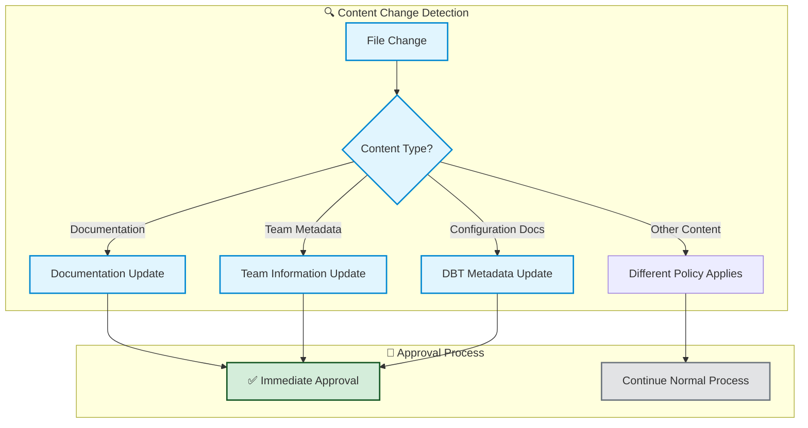

# 📄 Metadata Rule - Documentation & Development Efficiency Policy

**Business Purpose**: Accelerates development workflows by automatically approving low-risk documentation and metadata changes, eliminating approval bottlenecks for content updates.

**Compliance Scope**: Ensures documentation and team metadata remain current while maintaining zero operational risk for content-only changes.

## 📊 Policy Overview



## 📋 What Content Changes Are Covered

**This policy applies to**:
- **Documentation Files**: README, guides, API documentation (`.md`, `.txt`)
- **Team Metadata**: Team member information, contact details (`developers.yaml`)
- **Project Information**: Changelogs, license files, code ownership
- **Configuration Documentation**: DBT service descriptions in product files

**File Requirements**: Text-based content files and metadata configurations

## 🤖 Automated Approval Criteria

**Documentation and metadata changes qualify for automatic approval because they**:

1. **Zero Operational Risk**: Content changes don't affect system functionality
2. **Encourage Documentation**: Removes barriers to keeping information current
3. **Support Collaboration**: Enables immediate team information updates

## ✅ Approval Scenarios

### 🟢 Automatic Approval Examples

**Scenario 1**: Team updates project documentation
```markdown
# README.md
# Analytics Data Product

## Overview
This data product processes customer analytics data...

## Setup Instructions  
1. Clone the repository
2. Install dependencies  
3. Configure environment variables
```

**Result**: ✅ **Auto-Approved** - Documentation updates
- ✅ README file improvements
- ✅ Enhanced project documentation
- ✅ Better developer onboarding

**Scenario 2**: Configuration documentation
```yaml
# In product.yaml - DBT metadata section
service_account:
  dbt: true
```

**Result**: ✅ **Auto-Approved** - Configuration documentation
- ✅ Service description updates
- ✅ Environmental information
- ✅ Better operational clarity

## 🔧 Supported Content Types

**Documentation categories and typical usage**:

- **Project Documentation**: README files, setup guides, API documentation
- **Team Information**: Contact details, team structure, responsibilities  
- **Version Control**: Changelogs, release notes, contributor information
- **Legal Documentation**: License files, attribution, terms
- **Operational Documentation**: Service descriptions, configuration guides

## 📊 Policy Compliance Matrix

| **Content Type** | **Auto-Approval** | **Review Required** | **Business Rationale** |
|------------------|-------------------|-------------------|----------------------|
| **Documentation Files** | ✅ Yes | None | Encourage current documentation |
| **Team Metadata** | ✅ Yes | None | Support team transparency |
| **Version History** | ✅ Yes | None | Maintain change tracking |
| **Configuration Docs** | ✅ Yes | None | Improve operational clarity |


---

**📋 Policy Summary**: This rule automatically approves all documentation and metadata changes to eliminate approval bottlenecks while maintaining zero operational risk.

**🔍 For Technical Details**: Implementation specifications available in technical documentation