# 🛡️ Naysayer Rules Documentation

This directory contains detailed documentation for each validation rule implemented in Naysayer. Each rule has its own focused documentation explaining what it validates, when it triggers, and how to resolve common issues.

> **🎯 Quick Navigation**: Find your rule below and click the link for detailed guidance.

## 📚 Available Rules

### 🏢 [Warehouse Rule](WAREHOUSE_RULE.md)
**Validates**: Data product warehouse configurations  
**Triggers on**: `dataproducts/*/product.yaml` files  
**Purpose**: Cost control and configuration integrity  
**Key behavior**: Auto-approves size reductions, requires approval for increases

## 🎯 Quick Problem Resolution

### My MR is Blocked - What Now?

1. **Check which rule is triggering**: Look at the MR comments or logs
2. **Read the specific rule documentation**: Click the rule link above
3. **Follow the troubleshooting section**: Each rule doc has common solutions
4. **Fix and retry**: Make the suggested changes and push updates

### Common Issues by File Type

| **File Pattern** | **Rule** | **Common Issues** | **Quick Fix** |
|------------------|----------|-------------------|---------------|
| `dataproducts/*/product.yaml` | [Warehouse](WAREHOUSE_RULE.md) | Size increases, YAML syntax | Use `XSMALL`/`SMALL`/`MEDIUM`/`LARGE`, validate YAML |

## ⚙️ Rule System Overview

### How Rules Work

```mermaid
graph TD
    A[GitLab MR Created] --> B[Naysayer Webhook Triggered]
    B --> C{Files Match Rule Patterns?}
    C -->|No| D[Skip Validation]
    C -->|Yes| E[Run Applicable Rules]
    E --> F{All Rules Approve?}
    F -->|Yes| G[✅ Auto-Approve MR]
    F -->|No| H[⚠️ Manual Review Required]
```



### Decision Logic

- **Fail-Fast**: If ANY rule requires manual review, the entire MR needs review
- **Independent**: Each rule evaluates files independently
- **Configurable**: Rules can be enabled/disabled via environment variables

### Rule Categories

| **Category** | **Purpose** | **Examples** |
|--------------|-------------|--------------|
| 🏢 **Cost Control** | Prevent unexpected cost increases | Warehouse size validation |
| 🔒 **Security** | Enforce security policies | Service account email validation |
| 📋 **Compliance** | Meet organizational standards | Naming conventions, documentation |
| 🔧 **Configuration** | Ensure valid configurations | YAML syntax, required fields |

## 🎯 For Different Audiences

### 👨‍💻 **Developers**
Working on MRs that get blocked by rules:
- Read specific rule documentation for your file type
- Follow troubleshooting guides
- Use provided examples for proper configuration

### 👥 **Team Leads** 
Understanding why MRs require review:
- Review rule purposes and business justification
- Understand cost and security implications
- Guide team on best practices

### 🔧 **Platform Engineers**
Managing and configuring rules:
- See [Rule Creation Guide](../RULE_CREATION_GUIDE.md) for implementation
- See [Development Setup Guide](../DEVELOPMENT_SETUP.md) for settings
- Monitor rule performance and effectiveness

### 🛡️ **Security Teams**
Understanding security controls:
- Review security policies and requirements
- Understand risk mitigation strategies
- Configure security policies and exceptions

## 📊 Rule Status Dashboard

### Active Rules Summary

| **Rule** | **Status** | **Auto-Approval Rate** | **Common Issues** |
|----------|------------|------------------------|-------------------|
| 🏢 **Warehouse** | ✅ Active | ~85% | Size increases (15%) |

### Performance Metrics

- **Average rule execution time**: < 3 seconds
- **False positive rate**: < 2%
- **System availability**: 99.9%

## ⚙️ Global Configuration

### Environment Variables

Control rule behavior globally:

```bash
# Enable/disable all rules
RULES_ENABLED=true

# Global timeout for rule execution
RULES_TIMEOUT=30

# Debug logging for all rules
RULES_DEBUG=false

# Maximum file size for processing
RULES_MAX_FILE_SIZE=5242880  # 5MB
```

### Per-Rule Configuration

Each rule can be configured independently:

```bash
# Warehouse Rule
WAREHOUSE_RULE_ENABLED=true
WAREHOUSE_ALLOW_SIZE_INCREASES=false
```

## 🔧 Troubleshooting

### Universal Solutions

These apply to all rules:

#### YAML Syntax Issues
```bash
# Validate YAML before committing
yamllint your-file.yaml

# Or use online validator
# https://yaml-online-parser.appspot.com/
```

#### File Path Issues
- Check exact file path matches rule patterns
- Verify case sensitivity
- Ensure proper directory structure

#### Permission Issues
- Verify GitLab token has file access
- Check repository permissions
- Contact platform team if persistent

### Getting Debug Information

Enable debug logging to see detailed rule execution:

```bash
# Set environment variables
export RULES_DEBUG=true
export LOG_LEVEL=debug

# Check logs for detailed execution info
kubectl logs -f deployment/naysayer | grep rule_execution
```

## 🆘 Getting Help

### Escalation Path

1. **Self-service**: Read rule-specific documentation
2. **Team consultation**: Discuss with team leads or senior developers
3. **Platform support**: Contact platform team for technical issues
4. **Security review**: Contact security team for policy questions
5. **Emergency**: Use on-call procedures for production blockers

### When to Contact Support

- Persistent rule failures after following documentation
- Questions about rule policies or requirements
- Need for emergency bypasses
- Issues with rule performance or availability

### Information to Provide

When requesting help:
- **MR URL**: Link to blocked merge request
- **Rule name**: Which specific rule is blocking
- **Error message**: Complete error text from logs
- **File content**: Relevant configuration files
- **Expected behavior**: What you think should happen

## 📈 Rule Development

### For Rule Authors

Interested in creating new rules? See these guides:

- 🎯 [Rule Creation Guide](../RULE_CREATION_GUIDE.md) - Complete implementation guide
- 🧪 [Development Setup Guide](../DEVELOPMENT_SETUP.md) - Testing strategies and patterns

### Contributing

To contribute to rule documentation:
1. Follow the structure of existing rule documents
2. Include troubleshooting and examples
3. Test with real scenarios
4. Submit PR with clear description

## 📚 Related Documentation

| **Topic** | **Document** | **Audience** |
|-----------|--------------|--------------|
| **Creating Rules** | [Rule Creation Guide](../RULE_CREATION_GUIDE.md) | Developers |
| **Development Setup** | [Development Setup Guide](../DEVELOPMENT_SETUP.md) | Developers |
| **API Reference** | [API Reference](../API_REFERENCE.md) | Platform Engineers |
| **Troubleshooting** | [Troubleshooting Guide](../TROUBLESHOOTING.md) | Operators |

---

**💡 Pro Tip**: Bookmark the specific rule documentation for files you work with frequently. Most issues can be resolved quickly by following the rule-specific troubleshooting guides.