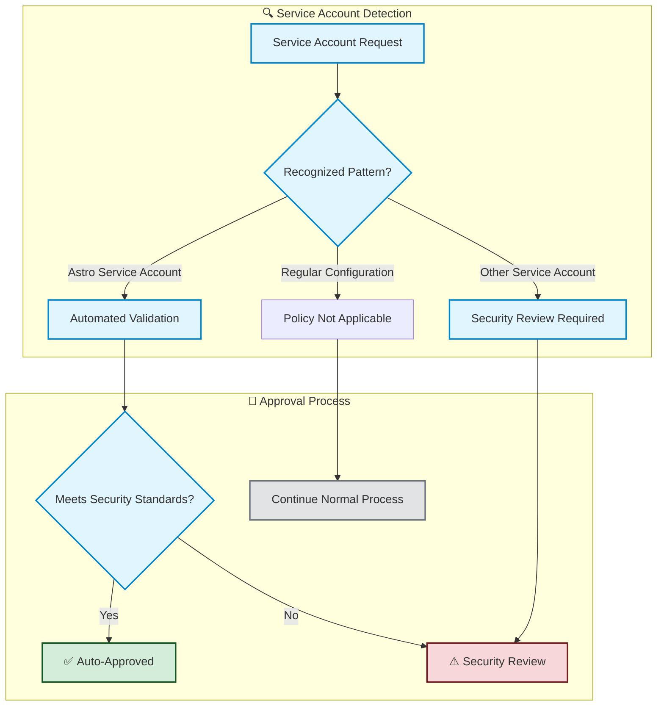

# 🔒 Service Account Rule - Security & Compliance Policy

**Business Purpose**: Automatically approves trusted Astro service account configurations while ensuring all other service accounts receive proper security review and approval.

**Compliance Scope**: Enforces organizational identity management policies and maintains audit trails for service account access controls.

## 📊 Policy Overview



## 📋 What Service Accounts Are Covered

**This policy applies to configurations for**:
- Astro platform service accounts
- Generic service account configurations  
- Service accounts in dedicated directories

**File Requirements**: Configuration files must be in YAML format (.yaml or .yml)

## 🤖 Automated Approval Criteria

**Astro Service Accounts qualify for automatic approval when they meet these requirements**:

1. **Astro Platform Pattern**: File follows Astro naming convention
2. **Valid Configuration**: YAML structure is correct and parseable
3. **Identity Verified**: Service account name matches the intended identity

### Business Requirements for Auto-Approval

| **Requirement** | **Business Rationale** | **Compliance Benefit** |
|-----------------|------------------------|------------------------|
| **Astro Platform Pattern** | Trusted automated platform with established security controls | Reduces manual review burden for known-safe accounts |
| **Naming Convention** | Prevents unauthorized account creation and identity confusion | Maintains clear audit trail and account ownership |
| **Configuration Validity** | Ensures service accounts are properly defined and functional | Prevents service disruptions and security gaps |
| **Identity Consistency** | Account name must match intended identity and purpose | Prevents identity spoofing and unauthorized access |

## ✅ Approval Scenarios

### 🟢 Automatic Approval Example

**Scenario**: Marketing team deploys Astro service account for production data pipeline

**Configuration**: `marketing_astro_prod_appuser.yaml`
```yaml
name: marketing_astro_prod_appuser
metadata:
  name: marketing_astro_prod_appuser
  namespace: marketing-prod
spec:
  type: astro-service-account
```

**Result**: ✅ **Auto-Approved** - Meets all security requirements
- ✅ Recognized Astro platform pattern
- ✅ Valid configuration structure
- ✅ Identity consistency verified
- ✅ Follows organizational naming standards

### 🟡 Manual Review Required Examples

**1. Identity Mismatch Risk**
```yaml
# File: analytics_astro_dev_appuser.yaml
name: different_service_name  # ❌ Name doesn't match file identity
```
**Concern**: Potential identity spoofing or configuration error

**2. Missing Identity Information**
```yaml
# File: finance_astro_prod_appuser.yaml
metadata:  # ❌ Missing required identity field
  namespace: finance-prod
```
**Concern**: Incomplete service account definition

**3. Non-Astro Service Account**
```yaml
# File: custom_serviceaccount.yaml
metadata:
  name: custom-analytics-service  # ❌ Not Astro platform
```
**Concern**: Requires security team evaluation for access controls

## 🔧 Service Account Categories

**Service accounts are classified into these categories**:

- **Astro Platform**: Trusted automation accounts → ✅ **Auto-approved** → Operational efficiency
- **Manual Setup**: Custom service accounts → 🔍 **Security review** → Compliance assurance  
- **Directory-Based**: Generic configurations → 🔍 **Security review** → Access control validation
- **Custom Pattern**: Non-standard accounts → 🔍 **Security review** → Risk assessment

## 📊 Policy Compliance Matrix

| **Service Account Type** | **Auto-Approval** | **Review Required** | **Business Impact** |
|--------------------------|-------------------|-------------------|-------------------|
| **Astro Platform** | ✅ Yes | None | Faster deployment, operational efficiency |
| **Manual Service Accounts** | ❌ No | Security team | Ensures proper access controls |
| **Custom Configurations** | ❌ No | Security + Manager | Prevents unauthorized access |
| **Non-Service Accounts** | ➖ Not Applicable | N/A | Policy doesn't apply |

## 🔒 Security & Compliance Benefits

### Risk Mitigation
- **Identity Verification**: Prevents service account impersonation
- **Naming Standards**: Maintains clear ownership and purpose tracking
- **Configuration Validation**: Ensures accounts are properly defined
- **Audit Trail**: All decisions logged for compliance reporting

### Compliance Assurance
- **Access Controls**: Manual review for all non-astro service accounts
- **Documentation**: Clear rationale for all approval decisions
- **Monitoring**: Continuous validation of service account policies
- **Reporting**: Audit-ready logs for compliance reviews

---

**📋 Policy Summary**: This rule automatically approves Astro service accounts that meet security standards while ensuring all other service accounts receive appropriate security review.

**🔍 For Technical Details**: Implementation specifications available in technical documentation