# 🏢 Warehouse Rule

The Warehouse Rule validates data product warehouse configurations to ensure cost control and configuration integrity.

> **🎯 Quick Summary**: Auto-approves warehouse size reductions and valid configurations. Requires manual review for size increases and configuration errors.

## 📁 When Does This Rule Apply?

The warehouse rule triggers when your MR modifies files matching these patterns:
- `**/product.yaml` (containing warehouse configurations)
- `**/product.yml`

**Examples of triggering files**:
- `dataproducts/analytics/helloaggregate/dev/product.yaml`
- `dataproducts/reporting/prod/product.yml`

### 🧩 YAML Section-Aware Validation

The warehouse rule now uses **line-level validation** and covers the entire warehouse file:

- **Entire file** - Complete warehouse configuration validation

**Example of what the rule validates**:
```yaml
---
name: helloaggregate           # ✅ Validated by warehouse rule
kind: aggregated               # ✅ Validated by warehouse rule
warehouses:                    # ✅ Validated by warehouse rule
- type: user                   #     (All lines in file)
  size: XSMALL                 
- type: service_account        
  size: XSMALL                 
service_account:               # ✅ Validated by warehouse rule  
  dbt: true                    #     (All lines in file)
tags:                          # ✅ Validated by warehouse rule
  data_product: helloaggregate # ✅ (All lines in file)
```

## ✅ Auto-Approved Changes

Your MR will be **automatically approved** if:

### ✅ **Warehouse Size Reductions**
Cost-saving changes are auto-approved:
- `LARGE` → `MEDIUM`, `SMALL`, or `XSMALL`
- `MEDIUM` → `SMALL` or `XSMALL`
- `SMALL` → `XSMALL`

```yaml
# ✅ Auto-approved: Cost reduction in warehouses section
warehouses:
- type: user
  size: XSMALL    # Changed from SMALL
- type: service_account  
  size: SMALL     # Changed from MEDIUM
```

### ✅ **Valid Configuration Updates**
Well-formed configurations pass validation:
- Proper YAML syntax in validated sections
- Valid warehouse size values (`XSMALL`, `SMALL`, `MEDIUM`, `LARGE`)
- Correct warehouse section structure
- Service account configurations without issues

```yaml
# ✅ Auto-approved: Valid warehouse section configuration
name: "analytics-data-product"    # ⏭️ Not warehouse rule responsibility
warehouses:                       # ✅ Warehouse rule validates this
- type: user
  size: MEDIUM                    # Valid size value
- type: service_account
  size: SMALL                     # Valid size value
service_account:                  # ✅ Warehouse rule validates this
  dbt: true                       # Valid service account config
```

### ✅ **Complete File Validation**
With line-level validation, the warehouse rule validates the entire warehouse file:
- All changes in `product.yaml` files are validated by the warehouse rule
- The rule provides complete coverage for warehouse configuration files
- All sections affect this rule's decision

## ⚠️ Manual Review Required

Your MR will require **manual review** if:

### ⚠️ **Warehouse Size Increases**
Cost-impacting changes need approval:
- `XSMALL` → `SMALL`, `MEDIUM`, or `LARGE`
- `SMALL` → `MEDIUM` or `LARGE`
- `MEDIUM` → `LARGE`

```yaml
# ⚠️ Manual review: Cost increase in warehouse section
warehouses:
- type: user
  size: LARGE     # Changed from MEDIUM
- type: service_account
  size: MEDIUM    # Changed from SMALL
```

**Why?** Size increases have budget implications and require cost approval.

### ⚠️ **Configuration Issues**

#### Malformed YAML Syntax
```yaml
# ❌ Invalid: Missing quotes for special characters
name: Data Product: Analytics

# ✅ Valid: Properly quoted
name: "Data Product: Analytics"
```

#### Invalid Warehouse Size Values
```yaml
# ❌ Invalid: Lowercase not supported
warehouse: medium

# ✅ Valid: Uppercase required
warehouse: MEDIUM
```

#### Missing Required Fields
```yaml
# ❌ Invalid: Missing required fields
warehouse: LARGE

# ✅ Valid: Complete configuration
name: "my-data-product"
warehouse: LARGE
description: "Product description"
owner: "team@company.com"
```

### ⚠️ **File Access Problems**
Technical issues trigger manual review:
- Cannot fetch file content from GitLab
- Network timeouts or API errors
- File permission issues

### Configuration Validation Flow

```mermaid
flowchart TD
    A[📋 Warehouse Configuration] --> B{🔍 Required Fields Check}
    B -->|❌ Missing| C[⚠️ Missing Fields Error<br/>• name<br/>• warehouse<br/>• description<br/>• owner]
    B -->|✅ Complete| D{📏 Size Value Check}
    
    D -->|❌ Invalid| E[⚠️ Invalid Size Error<br/>Must be: SMALL, MEDIUM, LARGE]
    D -->|✅ Valid| F{📝 YAML Syntax Check}
    
    F -->|❌ Invalid| G[⚠️ Syntax Error<br/>• Quotes missing<br/>• Indentation wrong<br/>• Special characters]
    F -->|✅ Valid| H[✅ Configuration Valid]
    
    classDef errorNode fill:#f8d7da,stroke:#721c24,stroke-width:2px,color:#721c24
    classDef successNode fill:#d4edda,stroke:#155724,stroke-width:2px,color:#155724
    classDef processNode fill:#e2e3e5,stroke:#6c757d,stroke-width:2px,color:#495057
    
    class C,E,G errorNode
    class H successNode
    class A,B,D,F processNode
```



### File Processing Pipeline

```mermaid
sequenceDiagram
    participant U as 👤 User
    participant G as 📁 GitLab
    participant N as 🤖 Naysayer
    participant R as 🏢 Warehouse Rule
    
    U->>G: 📤 Push warehouse changes
    G->>N: 🔔 Webhook: MR created/updated
    N->>R: 🎯 Check if rule applies
    R->>R: 🔍 Analyze file patterns
    
    alt 📁 Warehouse file detected
        R->>G: 📥 Fetch file content
        G-->>R: 📄 Return file content
        R->>R: 🔍 Parse YAML syntax
        R->>R: ✅ Validate configuration
        R->>R: 📊 Analyze size changes
        
        alt 📉 Size reduction or no change
            R->>N: ✅ Auto-approve
            N->>G: 🎉 Approve MR
            G->>U: ✅ MR approved automatically
        else 📈 Size increase
            R->>N: ⚠️ Manual review required
            N->>G: 🔍 Request manual review
            G->>U: ⚠️ Manual review needed
        end
    else 📁 No warehouse files
        R->>N: ⏭️ Skip rule
        N->>G: ➡️ Continue with other rules
    end
```



## 🔧 Troubleshooting

### Common Error Messages

#### "Invalid warehouse size"
**Cause**: Using unsupported warehouse size value  
**Solution**: Use only `SMALL`, `MEDIUM`, or `LARGE` (uppercase)

```yaml
# ❌ These are invalid
warehouse: small
warehouse: Medium  
warehouse: XL

# ✅ These are valid
warehouse: SMALL
warehouse: MEDIUM
warehouse: LARGE
```

#### "Malformed YAML"
**Cause**: YAML syntax errors  
**Solution**: Validate YAML syntax before committing

```yaml
# ❌ Invalid: Unquoted special characters
description: Cost: $500/month

# ✅ Valid: Properly quoted
description: "Cost: $500/month"
```

#### "Missing required fields"
**Cause**: Required configuration fields not present  
**Solution**: Include all mandatory fields

```yaml
# ✅ Minimum required configuration
name: "product-name"           # Required
warehouse: MEDIUM              # Required  
description: "Brief description" # Required
owner: "team@company.com"      # Required
```

#### "Failed to fetch file"
**Cause**: File access or network issues  
**Solutions**:
1. Check file exists at the correct path
2. Verify GitLab permissions
3. Retry if temporary network issue
4. Contact platform team if persistent

### Validation Steps

1. **Check file path**: Ensure file is in `dataproducts/*/product.yaml` format
2. **Validate YAML**: Use online YAML validator or `yamllint`
3. **Verify size value**: Must be exactly `XSMALL`, `SMALL`, `MEDIUM`, `LARGE`, etc.
4. **Include required fields**: name, warehouses section with proper configuration
5. **Test locally**: Parse YAML to catch syntax issues early

## ⚙️ Configuration

### Environment Variables

```bash
# Enable/disable warehouse validation
WAREHOUSE_RULE_ENABLED=true

# Allow warehouse size increases (bypasses cost approval)
WAREHOUSE_ALLOW_SIZE_INCREASES=false

# Maximum file size to process (bytes)
WAREHOUSE_MAX_FILE_SIZE=1048576  # 1MB

# Strict mode (additional validations)
WAREHOUSE_STRICT_MODE=false

# Debug logging
WAREHOUSE_DEBUG=false
```

### Default Configuration

```yaml
# Default settings applied if not specified
warehouse_rule:
  enabled: true
  allow_size_increases: false
  max_file_size: 1048576
  strict_mode: false
  required_fields:
    - name
    - warehouse  
    - description
    - owner
  valid_sizes:
    - SMALL
    - MEDIUM
    - LARGE
```

## 📊 Rule Behavior

### Decision Logic Flow

```mermaid
graph TB
    A[📁 MR File Changes] --> B{🏢 Warehouse YAML File?}
    B -->|❌ No| C[⏭️ Skip Rule<br/>Not applicable]
    B -->|✅ Yes| D[🔍 Fetch File Content]
    
    D --> E{📥 File Access OK?}
    E -->|❌ No| F[⚠️ Manual Review<br/>🚫 Access Error]
    E -->|✅ Yes| G{📝 Valid YAML Syntax?}
    
    G -->|❌ No| H[⚠️ Manual Review<br/>🚫 Syntax Error]
    G -->|✅ Yes| I[🔍 Analyze Configuration]
    
    I --> J{📊 Warehouse Size Change?}
    J -->|🔄 No Change| K{✅ Valid Config?}
    J -->|📉 Size Reduction| L[💰 Cost Savings Detected]
    J -->|📈 Size Increase| M[⚠️ Manual Review<br/>💸 Cost Impact Review]
    
    L --> K
    K -->|❌ Invalid| N[⚠️ Manual Review<br/>🚫 Config Issues]
    K -->|✅ Valid| O[✅ Auto-Approve<br/>🎉 Changes Approved]
    
    classDef approveNode fill:#d4edda,stroke:#155724,stroke-width:2px,color:#155724
    classDef reviewNode fill:#f8d7da,stroke:#721c24,stroke-width:2px,color:#721c24
    classDef processNode fill:#e2e3e5,stroke:#6c757d,stroke-width:2px,color:#495057
    classDef skipNode fill:#fff3cd,stroke:#856404,stroke-width:2px,color:#856404
    
    class O approveNode
    class F,H,M,N reviewNode
    class A,D,I,L processNode
    class C skipNode
```



### Cost Impact Analysis

```mermaid
graph LR
    subgraph "💰 Cost Impact Matrix"
        A[SMALL] -.->|📈 +Cost| B[MEDIUM]
        A -.->|📈 ++Cost| C[LARGE]
        B -->|📉 -Cost| A
        B -.->|📈 +Cost| C
        C -->|📉 -Cost| A
        C -->|📉 -Cost| B
    end
    
    subgraph "🎯 Decision Rules"
        D[📉 Size Reduction<br/>Auto-Approve] 
        E[📈 Size Increase<br/>Manual Review]
    end
    
    A -.->|Increase| E
    B -.->|Increase| E
    B -->|Decrease| D
    C -->|Decrease| D
    
    classDef increase fill:#f8d7da,stroke:#721c24,stroke-width:2px,color:#721c24
    classDef decrease fill:#d4edda,stroke:#155724,stroke-width:2px,color:#155724
    classDef neutral fill:#e2e3e5,stroke:#6c757d,stroke-width:2px
    
    class E increase
    class D decrease
    class A,B,C neutral
```



### Cost Impact Matrix

| **From** | **To** | **Cost Impact** | **Decision** | **Reason** |
|----------|--------|----------------|--------------|------------|
| 🔹 SMALL | 🔸 MEDIUM | 📈 +Cost | ⚠️ Manual Review | Cost increase requires approval |
| 🔹 SMALL | 🔶 LARGE | 📈 ++Cost | ⚠️ Manual Review | Significant cost increase |
| 🔸 MEDIUM | 🔹 SMALL | 📉 -Cost | ✅ Auto-Approve | Cost reduction approved |
| 🔸 MEDIUM | 🔶 LARGE | 📈 +Cost | ⚠️ Manual Review | Cost increase requires approval |
| 🔶 LARGE | 🔹 SMALL | 📉 --Cost | ✅ Auto-Approve | Significant cost reduction |
| 🔶 LARGE | 🔸 MEDIUM | 📉 -Cost | ✅ Auto-Approve | Cost reduction approved |

### Configuration Examples Comparison

```mermaid
graph TB
    subgraph "✅ Valid Configurations"
        A["📋 Complete Config<br/>---<br/>name: 'analytics-pipeline'<br/>warehouse: MEDIUM<br/>description: 'Analytics processing'<br/>owner: 'team@company.com'"]
        B["📋 Minimal Valid<br/>---<br/>name: 'simple-service'<br/>warehouse: SMALL<br/>description: 'Basic service'<br/>owner: 'dev@company.com'"]
    end
    
    subgraph "❌ Invalid Configurations"
        C["🚫 Missing Fields<br/>---<br/>warehouse: LARGE<br/># Missing: name, description, owner"]
        D["🚫 Invalid Size<br/>---<br/>name: 'test'<br/>warehouse: medium<br/># Should be: MEDIUM"]
        E["🚫 YAML Syntax Error<br/>---<br/>name: Data: Analytics<br/># Missing quotes for special chars"]
    end
    
    classDef validConfig fill:#e8f5e8,stroke:#388e3c,stroke-width:2px,color:#155724
    classDef invalidConfig fill:#ffebee,stroke:#d32f2f,stroke-width:2px,color:#721c24
    
    class A,B validConfig
    class C,D,E invalidConfig
```



## 🎯 Best Practices

### Writing Warehouse Configurations

```yaml
# ✅ Good example
name: "analytics-pipeline"
warehouse: MEDIUM
description: "Daily analytics data processing pipeline"
owner: "analytics-team@company.com"
environment: "production"
cost_center: "data-analytics"
schedule: "0 2 * * *"  # Daily at 2 AM
```

### Size Selection Guidelines

- **SMALL**: Development, testing, small datasets
- **MEDIUM**: Production workloads, moderate datasets  
- **LARGE**: High-volume processing, large datasets

### Change Management

1. **Size increases**: Prepare business justification before requesting
2. **Documentation**: Update descriptions when changing configurations
3. **Testing**: Validate changes in development environment first
4. **Monitoring**: Track usage and costs after size changes

## 🆘 Getting Help

### When to Contact Support

- Persistent validation failures after fixing syntax
- Questions about appropriate warehouse sizing
- Issues with file access or permissions
- Need emergency size increase approval

### Information to Include

- **MR URL**: Link to blocked merge request
- **File path**: Exact path to product.yaml file
- **Error message**: Complete error text from rule
- **Configuration**: Current and desired product.yaml content
- **Business justification**: For size increase requests

### Emergency Procedures

For urgent production issues requiring immediate size increases:

1. Contact on-call team with justification
2. Request temporary bypass if available
3. Follow up with proper approval process
4. Document incident for review

## 📈 Monitoring

### Key Metrics

- **Auto-approval rate**: Percentage of changes approved automatically
- **Size increase requests**: Frequency and justification quality
- **Configuration errors**: Common syntax and validation issues
- **Cost impact**: Total cost changes from approved size increases

### Performance Targets

- **Rule execution time**: < 5 seconds per file
- **False positive rate**: < 2% of valid configurations blocked
- **Auto-approval rate**: > 85% of warehouse changes

## 📚 Related Documentation

- [Rule Creation Guide](../RULE_CREATION_GUIDE.md) - For developers
- [Configuration Management](../CONFIG_MANAGEMENT.md) - Global settings
- [Cost Management](../COST_MANAGEMENT.md) - Warehouse sizing guidelines

---

**💡 Pro Tip**: Most warehouse rule issues can be resolved by ensuring proper YAML syntax and using exact uppercase values for warehouse sizes (`SMALL`, `MEDIUM`, `LARGE`).