# 🏢 Warehouse Rule - Cost Control & Compliance Policy

**Business Purpose**: Automatically approves cost-saving warehouse configurations while ensuring all cost-increasing changes receive proper budget review and approval.

**Compliance Scope**: Enforces organizational cost governance policies for data warehouse resource management in product configurations.

## 📊 Policy Overview

```mermaid
graph TB
    subgraph "🔍 Warehouse Change Detection"
        A[Product Configuration Change] --> B{Contains Warehouse Changes?}
        B -->|Size Decrease| C[Cost Reduction - Auto-Approve]
        B -->|Size Increase| D[Cost Increase - Budget Review]
        B -->|No Warehouse Changes| E[Other Rules Apply]
    end
    
    subgraph "🎯 Approval Process"
        C --> F[✅ Immediate Approval]
        D --> G[⚠️ Manual Review Required]
        E --> H[Continue Normal Process]
    end
    
    classDef approve fill:#d4edda,stroke:#155724,stroke-width:2px
    classDef review fill:#f8d7da,stroke:#721c24,stroke-width:2px
    classDef ignore fill:#e2e3e5,stroke:#6c757d,stroke-width:2px
    classDef process fill:#e1f5fe,stroke:#0288d1,stroke-width:2px
    
    class F approve
    class G review
    class H ignore
    class A,B,C,D process
```



## 📋 What Warehouse Changes Are Covered

**This policy applies to**:
- Product configuration files (`product.yaml` or `product.yml`)
- Warehouse size changes in the `warehouses` section
- Changes affecting warehouse resource allocation

**File Requirements**: YAML-formatted product configuration files

**Example Warehouse Configuration**:
```yaml
# dataproducts/analytics/product.yaml
warehouses:
- type: user
  size: MEDIUM    # ← Size changes trigger this rule
- type: service_account
  size: SMALL
```

## 🤖 Automated Approval Criteria

**Warehouse size decreases qualify for automatic approval because they**:

1. **Reduce Costs**: Lower resource consumption saves operational expenses
2. **Improve Efficiency**: Right-sizing resources for actual needs
3. **Support Optimization**: Align with organizational cost control goals

## ✅ Approval Scenarios

### 🟢 Automatic Approval Examples

**Scenario 1**: Development team optimizes warehouse resources
```yaml
# Before
warehouses:
- type: user
  size: LARGE

# After  
warehouses:
- type: user
  size: MEDIUM    # ✅ Size decrease - auto-approved
```

**Result**: ✅ **Auto-Approved** - Cost reduction approved
- ✅ Warehouse size decreased from LARGE to MEDIUM
- ✅ Reduces operational costs
- ✅ Improves resource efficiency

**Scenario 2**: Multiple warehouse optimizations
```yaml
# Before
warehouses:
- type: user
  size: LARGE
- type: service_account
  size: MEDIUM

# After
warehouses:
- type: user
  size: MEDIUM    # ✅ Decrease approved
- type: service_account
  size: SMALL     # ✅ Decrease approved
```

**Result**: ✅ **Auto-Approved** - Multiple cost reductions approved

### 🟡 Manual Review Required Examples

**1. Warehouse Size Increase**
```yaml
# Before
warehouses:
- type: user
  size: SMALL

# After
warehouses:
- type: user
  size: MEDIUM    # ❌ Size increase requires review
```
**Concern**: Budget impact requires approval

**2. New Warehouse Addition**
```yaml
# Before
warehouses:
- type: user
  size: SMALL

# After
warehouses:
- type: user
  size: SMALL
- type: service_account
  size: MEDIUM    # ❌ New warehouse requires review
```
**Concern**: Additional resource costs require budget approval

## 🔧 Warehouse Categories

**Common warehouse types and typical usage**:

- **User Warehouses**: Interactive data analysis and reporting
- **Service Account Warehouses**: Automated data processing and ETL
- **Development Warehouses**: Testing and development activities
- **Production Warehouses**: Live business-critical operations

**Size progression**: XSMALL → SMALL → MEDIUM → LARGE
- **Decreases**: Always auto-approved (cost reduction)
- **Increases**: Always require manual review (budget impact)

## 📊 Policy Compliance Matrix

| **Change Type** | **Auto-Approval** | **Review Required** | **Business Rationale** |
|-----------------|-------------------|-------------------|----------------------|
| **Size Decrease** | ✅ Yes | None | Cost optimization aligns with efficiency goals |
| **Size Increase** | ❌ No | Budget team | Cost increases require budget approval |
| **New Warehouse** | ❌ No | Budget + Manager | Additional resources need justification |
| **Configuration Error** | ❌ No | Technical team | Prevent operational disruption |

## 🔒 Security & Compliance Benefits

### Cost Control
- **Automatic Optimization**: Immediate approval for cost-reducing changes
- **Budget Governance**: Manual review prevents unauthorized cost increases
- **Resource Efficiency**: Encourages right-sizing of warehouse resources
- **Audit Trail**: Complete record of all warehouse resource decisions

### Operational Efficiency
- **Faster Deployments**: No delays for cost-reducing optimizations
- **Focused Reviews**: Budget team concentrates on cost-increasing changes
- **Risk Management**: Technical validation for configuration changes
- **Consistency**: Standardized approval process across all teams

### Compliance Assurance
- **Budget Controls**: All cost increases require proper approval
- **Documentation**: Clear rationale for all resource allocation decisions
- **Monitoring**: Continuous validation of warehouse sizing policies
- **Reporting**: Complete audit trail for cost governance reviews

## 📈 Policy Metrics & Monitoring

**Expected Processing Distribution**:
- **Auto-Approved**: Warehouse size decreases and optimizations
- **Manual Review**: Size increases, new warehouses, configuration errors

**Business Outcomes**:
- **Cost Optimization** → Reduced operational expenses → **Business Value**
- **Budget Compliance** → Controlled cost increases → **Financial Governance**

### Success Indicators
- **Cost Reduction Rate**: Percentage of warehouse optimizations implemented
- **Budget Compliance**: Zero unauthorized warehouse cost increases
- **Review Efficiency**: Faster processing for cost-reducing changes
- **Resource Optimization**: Improved warehouse utilization ratios

---

**📋 Policy Summary**: This rule automatically approves warehouse configurations that reduce costs while ensuring all cost-increasing changes receive proper budget review and approval.

**🔍 For Technical Details**: Implementation specifications available in technical documentation